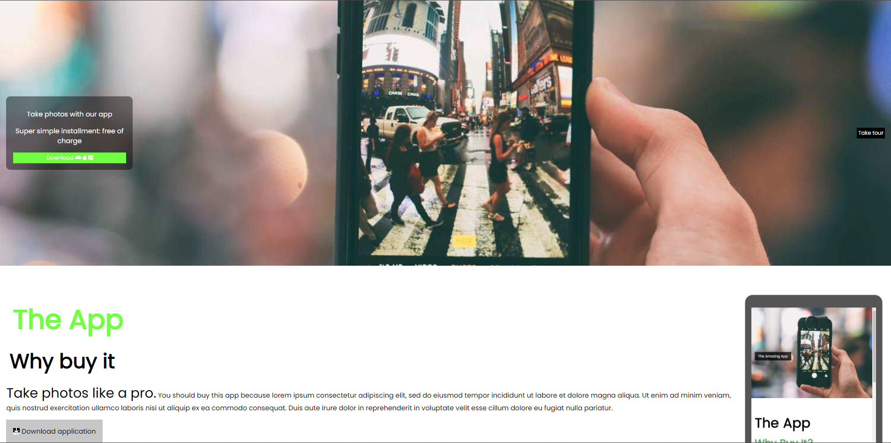
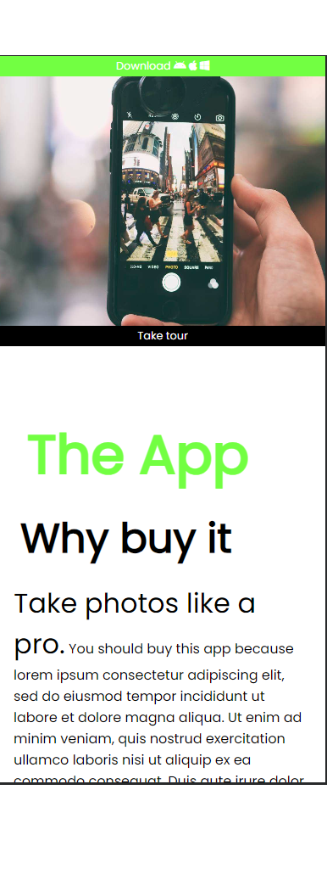

# Project Title

A brief description of what this project does and who it's for

- first item
- second item 

```echo "hello world"```
## Screenshots




## Deployment

To deploy this project run

```bash
  node index.js
```


## Documentation

[app2](https://github.com/Eriox76/app2)


## Optimizations

What optimizations did you make in your code? E.g. refactors, performance improvements, accessibility


## Roadmap

- Additional browser support

- Add more integrations


## License

[MIT](https://choosealicense.com/licenses/mit/)
